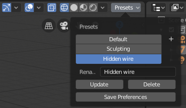

# Blender Viewport Presets

Download a release from https://github.com/scaredyfish/blender-viewport-presets/releases

Adds a presets menu to the 3D viewport header which allows you to save and recall various combinations of viewport display settings.

Hit the + button to save the current viewport settings as a preset.

Change the name of the currently selected preset using the text box.

Presets are saved is user preferences, so be sure to press the 'Save Preferences' button. 
